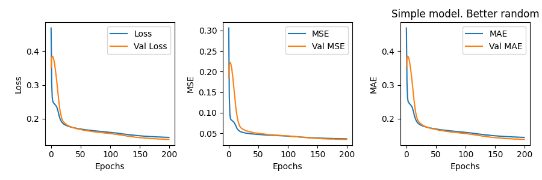
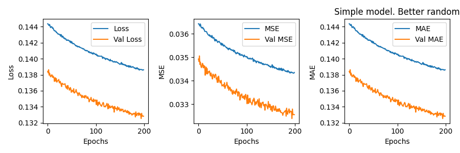

All notebooks for recommender system developent. Final model is developed with **FINAL-Recommender-MAL-SMOTE_better_pricing.ipynb**

Final used model: **recommender-smote-try-simple-I**

Used data: influencer profiles and user reviews

Influencer's data has aggregated categories, one-hot-encoded pricing, and categorized followers, which match the final deployement data.

Using user reviews, we can get user's recommender profile by multiplying review data with influencer's features, and then aggregating and averaging all of the values and getting user's recommender profile

Influencer's features and user's recommender profile becomes the input of 2 Neural Network model (influencer model and user model) which outputs 2 vectors with similar dimension. Using the dot product of both l2-normalized vectors, we get the final recommender score (value between 0-1)

Loss and MAE:

First 200 epoch:

Second 200 epoch

Result:
* test_error: 0.30004977456206133
* last_loss: 0.13861632347106934
* last_mae: 0.13861632347106934
* last_mse: 0.03434869647026062
* last_val_loss: 0.1328313946723938
* last_val_mae: 0.1328313946723938
* last_val_mse: 0.0325519479811191

More details can be seen in log
